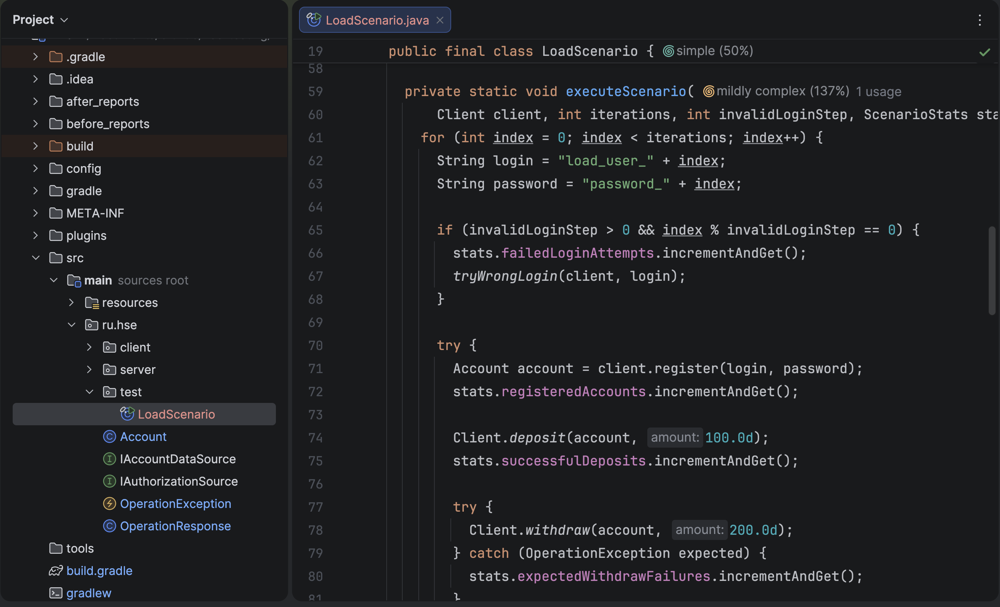
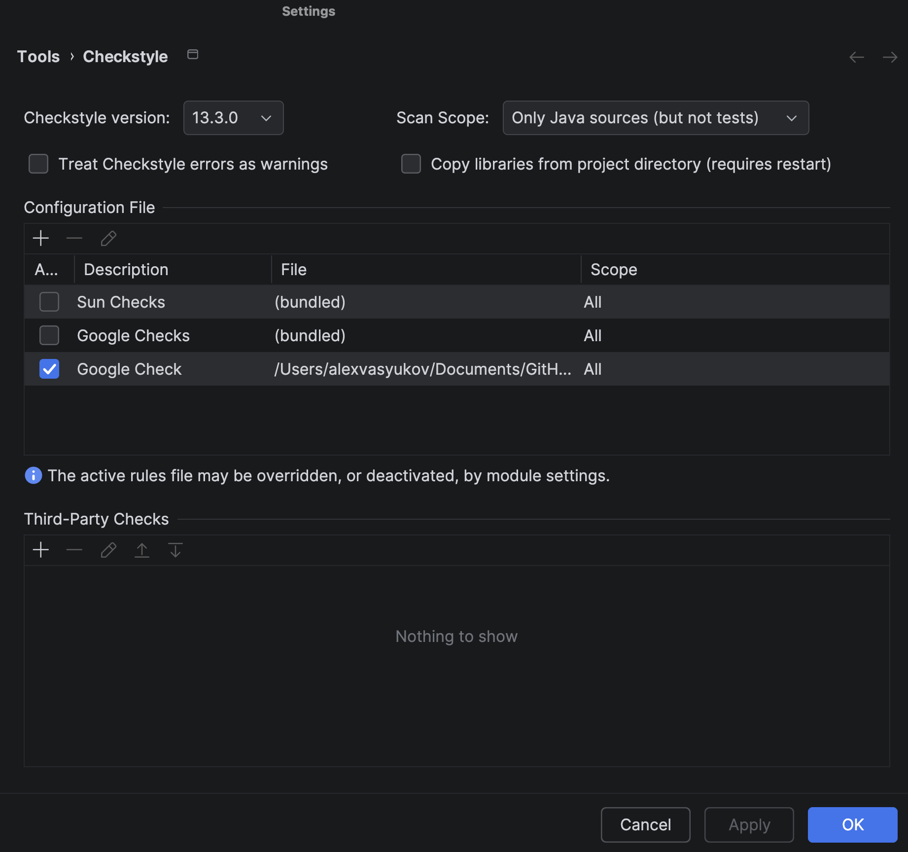
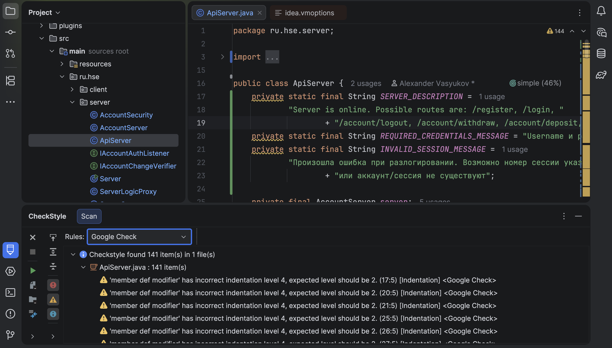
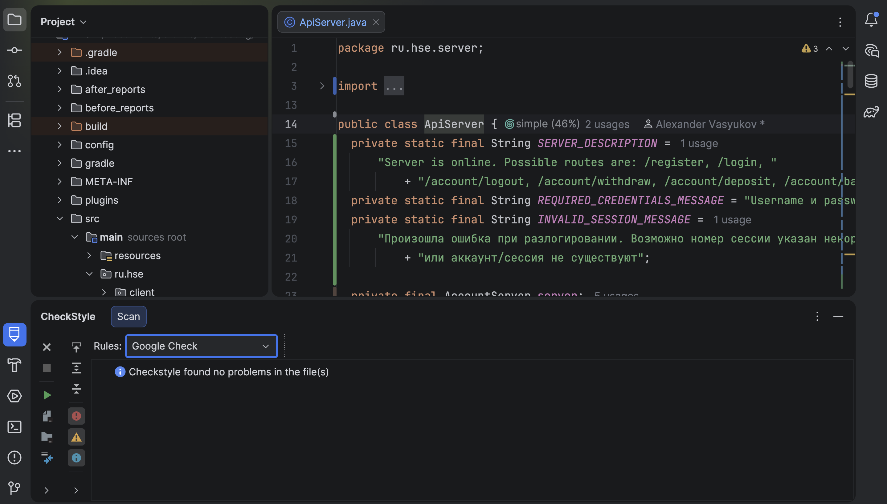

# Отчёт по практическому заданию

> Выполнил: Васюков Александр  
> Группа: БПИ-235   
> Email: avvasiukov@edu.hse.ru  

## 1. Цель работы

В рамках задания требовалось:

- подключить и использовать статические анализаторы `SpotBugs` и `PMD`;
- сохранить отчёты до исправлений и после исправлений;
- проанализировать проект с помощью IDE-плагинов;
- привести проект к `Google Java Style`;
- подготовить нагрузочный сценарий;
- выполнить профилирование и проверить требования к серверной части.

## 2. Состав сдачи

В архив сдачи включены:

- полный проект после исправлений;
- итоговый отчёт `report.md`;
- html-отчёты анализаторов в папках `before_reports/` и `after_reports/`;
- артефакты профилирования в папке `build/profiling/`;
- архивы плагинов в папке `plugins/`.

## 3. Подключение и запуск анализаторов

В `build.gradle` были подключены:

- `pmd`;
- `checkstyle`;
- `com.github.spotbugs`.

Также были настроены и использованы отдельные задачи:

- `pmdMain`;
- `spotbugsMain`;
- `checkstyleMain`;
- `pmdCognitive`;
- `runLoadTest`;
- `profileLoadTest`.

Команды запуска:

```bash
./gradlew compileJava pmdMain spotbugsMain checkstyleMain
./gradlew pmdCognitive
./gradlew runLoadTest
./gradlew profileLoadTest
```

## 4. Результаты статического анализа

### 4.1. Отчёты до исправлений

Базовый запуск анализаторов показал следующие результаты:

- `PMD`: 174 замечания;
- `SpotBugs`: 20 замечаний;
- `Checkstyle`: исходная конфигурация Google Style была некорректной и требовала исправления.

Сохранённые baseline-отчёты:

- `before_reports/pmd/main.html`
- `before_reports/spotbugs/main.html`
- `before_reports/problems/problems-report.html`

### 4.2. Основные найденные проблемы

В ходе анализа были обнаружены и исправлены следующие группы дефектов:

1. Ошибки работы с сессиями и удержанием объектов в памяти.
   После `logout` сервер продолжал удерживать ссылки на активные аккаунты и сессии.

2. Ошибки доступа к БД.
   В `ServerStorage` были проблемы с использованием `ResultSet`, а также дефект в `testSession`, где для `SELECT` применялся неверный способ выполнения запроса.

3. Нарушения корректного освобождения ресурсов.
   Были исправлены места с небезопасной работой с блокировками, HTTP-ответами и серверным shutdown.

4. Проблемы сериализации и качества модели данных.
   Класс `OperationResponse` был доработан до корректной сериализации и безопасной обработки данных.

5. Нарушения стиля и избыточная сложность отдельных частей кода.
   Код был приведён к Google Style, а сложные участки были упрощены.

### 4.3. Результаты после исправлений

После исправлений проект был прогнан повторно.

Итог:

- `PMD`: 0 замечаний;
- `SpotBugs`: 0 замечаний;
- `Checkstyle`: 0 замечаний.

Сохранённые итоговые отчёты:

- `after_reports/pmd/main.html`
- `after_reports/pmd/cognitive.html`
- `after_reports/spotbugs/main.html`
- `after_reports/checkstyle/main.html`
- `after_reports/problems/problems-report.html`

## 5. Исправления в проекте

### 5.1. Сервер и хранение состояния

Исправления были внесены в серверную часть проекта:

- `src/main/ru/hse/server/AccountServer.java`
- `src/main/ru/hse/server/Server.java`
- `src/main/ru/hse/server/ServerStorage.java`

Что исправлено:

- после `logout` активная сессия корректно очищается;
- сервер больше не удерживает лишние ссылки на аккаунты и сессии;
- исправлена работа с `Lock` и освобождением ресурсов;
- добавлено корректное закрытие `ServerStorage`;
- исправлена логика старта и завершения сервера.

### 5.2. HTTP API и клиентская часть

Исправления были внесены в:

- `src/main/ru/hse/server/ApiServer.java`
- `src/main/ru/hse/client/ApiClient.java`
- `src/main/ru/hse/client/AccountManager.java`

Что исправлено:

- упрощены DTO и обработка запросов;
- устранено дублирование кода;
- исправлена обработка `ResponseBody`;
- нормализована обработка `session id`;
- очищены предупреждения SpotBugs и PMD.

### 5.3. Модель и служебные классы

Исправления были внесены в:

- `src/main/ru/hse/OperationResponse.java`
- `src/main/ru/hse/OperationException.java`
- `src/main/ru/hse/Account.java`

Что исправлено:

- добавлена корректная сериализация;
- исправлена передача сообщений исключения;
- упрощён и выровнен код модели;
- исходники приведены к `Google Java Style`.

## 6. OpenIDE-плагины и Google Style

Для выполнения пункта по IDE были использованы архивы из папки `plugins/`:

- `code-complexity-plugin-1.6.4.zip`
- `checkstyle-idea-26.4.0.zip`
- `idea_plugin.zip` (`google-java-format`)

### 6.1. Когнитивная сложность

По результатам анализа сложности самым сложным методом в итоговом состоянии проекта стал:

- файл: `src/main/ru/hse/test/LoadScenario.java`
- метод: `executeScenario(Client, int, int, ScenarioStats)`
- значение: `Cognitive Complexity = 11`

Скриншот из IDE:



Дополнительно этот результат подтверждается отчётом:

- `after_reports/pmd/cognitive.html`

### 6.2. Подключение Google Checkstyle

Для проверки Java-кода по Google Style в IDE был подключён локальный файл:

- `config/checkstyle/google_checks.xml`

Скриншот подключения файла конфигурации:



### 6.3. Проверка до форматирования

До окончательного приведения проекта к Google Style IDE-проверка показывала нарушения форматирования и стиля.

Скриншот с замечаниями:



### 6.4. Проверка после форматирования

После применения форматирования и исправления замечаний проект был приведён к Google Style. Повторная проверка в IDE не показывает нарушений на демонстрационном файле.

Скриншот после исправлений:



## 7. Нагрузочный сценарий

Для проверки поведения сервера был добавлен отдельный тестовый сценарий:

- `src/main/ru/hse/test/LoadScenario.java`

Сценарий выполняет для большого числа аккаунтов следующую последовательность действий:

1. регистрация клиента;
2. пополнение счёта на `100`;
3. попытка снять `200` с ожидаемым отказом;
4. успешное снятие `50`;
5. `logout`.

Дополнительно в части прогонов выполняются намеренно неудачные попытки авторизации.

Сценарий запускался многократно в одном процессе, что соответствует требованию нагрузочного прогона.

## 8. Профилирование и проверка правил серверной части

### 8.1. Выполненные прогоны

Были выполнены:

- обычный прогон `./gradlew runLoadTest`;
- профилировочный прогон `./gradlew profileLoadTest`.

Полученные артефакты:

- `build/profiling/loadtest.jfr`
- `build/profiling/jfr-summary.txt`
- `build/profiling/session-check.txt`
- `build/profiling/load-test-summary-20260401-171447.txt`

### 8.2. Результат нагрузочного сценария

Итог последнего успешного прогона:

- 10 000 итераций;
- 10 000 успешных регистраций;
- 10 000 успешных пополнений;
- 10 000 ожидаемых отказов на `withdraw(200)`;
- 10 000 успешных `withdraw(50)`;
- 10 000 успешных `logout`;
- 40 намеренно неудачных логинов;
- 0 неожиданных ошибок.

### 8.3. Проверка требований к серверной части

По условию задания для серверной части требовалось проверить:

1. после `logout` всех аккаунтов вспомогательные потоки должны завершаться;
2. после `logout` информация о сессии и аккаунте должна оставаться только в базе.

Результат проверки:

- в `build/profiling/session-check.txt` зафиксировано отсутствие сохранённых сессий в persisted DB;
- сервер после завершения сценария корректно останавливается;
- соединения HikariPool корректно закрываются;
- долгоживущих фоновых потоков `ru.hse.*`, удерживающих сервер в рабочем состоянии после завершения сценария, не обнаружено.

Вывод:

- утечек памяти по объектам `ru.hse.*` в итоговой версии не выявлено;
- критичная проблема удержания активных аккаунтов и сессий после `logout` устранена;
- требования задания к поведению серверной части выполняются.

## 9. Что показать проверяющему

Во время сдачи удобно показать следующие материалы:

1. `build.gradle` с подключёнными анализаторами.
2. Папку `before_reports/` с отчётами до исправлений.
3. Папку `after_reports/` с отчётами после исправлений.
4. Файл `src/main/ru/hse/test/LoadScenario.java`.
5. Скриншоты из папки `screenshots/`.
6. Файл `build/profiling/loadtest.jfr` в профилировщике.
7. Файл `build/profiling/session-check.txt`.

## 10. Итог

В ходе выполнения работы были подключены и использованы статические анализаторы `SpotBugs`, `PMD` и `Checkstyle`, сохранены отчёты до исправлений и после исправлений, исправлены реальные дефекты серверной и клиентской частей, выполнено приведение проекта к `Google Java Style`, установлен и использован IDE-плагин для анализа когнитивной сложности, реализован нагрузочный сценарий и выполнено профилирование проекта.

Итоговая версия проекта проходит статический анализ без замечаний, корректно выполняет нагрузочный сценарий и удовлетворяет требованиям задания по завершению сессий и отсутствию утечек состояния после `logout`.
