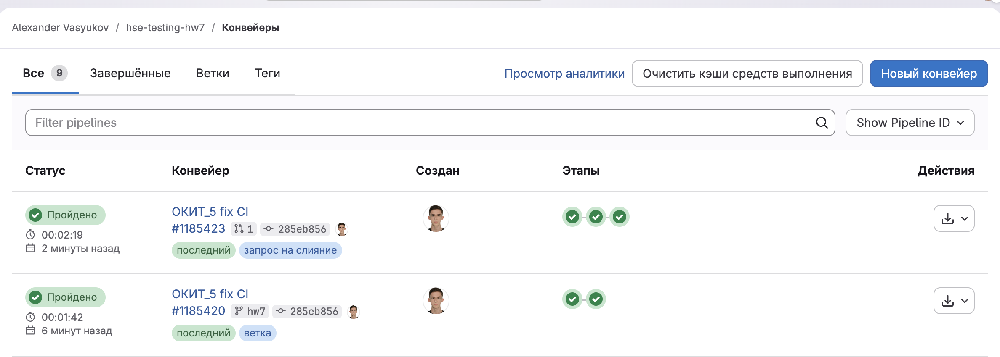
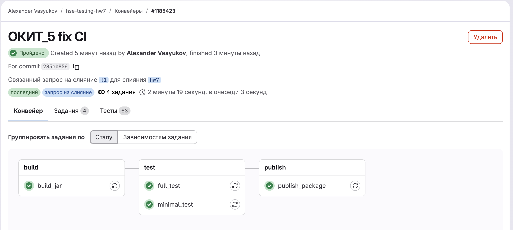
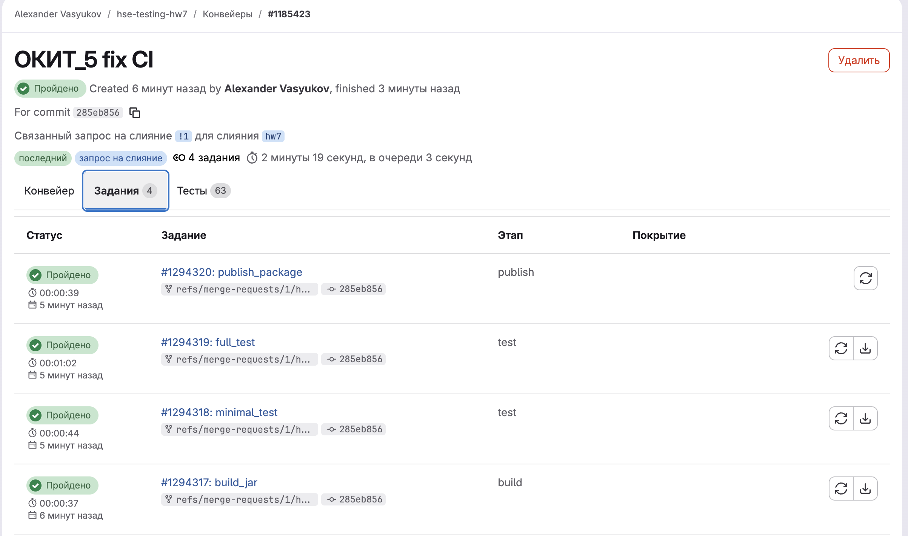

# Отчёт по домашнему заданию 7

> Выполнил: Васюков Александр  
> Группа: БПИ-235  
> Email: avvasiukov@edu.hse.ru  

## 1. Цель работы

В рамках задания требовалось:

- подготовить локальную проверку commit message через git hook;
- настроить `.gitlab-ci.yml` с этапами сборки, минимального теста, полного тестового прогона, публикации артефакта и ручного мутационного тестирования;
- довести тестовый набор проекта до успешного прохождения `pitest` с порогом не ниже `90%`;
- оформить отчёт и инструкцию по локальной и CI-проверке.

## 2. Реализация локального git hook

Для проверки commit message добавлен `commit-msg` hook в `.githooks/commit-msg`.

Поведение hook-а:

- проверяет наличие обязательной подстроки `ОКИТ_5` в сообщении коммита;
- при отсутствии тега завершает commit с ошибкой;
- при необходимости тег можно переопределить через переменную окружения `OKIT_COMMIT_TAG`.

Для подключения hook-ов добавлен скрипт:

```bash
sh scripts/install-git-hooks.sh
```

Скрипт настраивает `core.hooksPath` на каталог `.githooks`.

Проверка вручную показала, что:

- сообщение с `ОКИТ_5` проходит успешно;
- сообщение без тега отклоняется с диагностикой `Commit message must contain tag 'ОКИТ_5'.`

## 3. Реализация CI/CD pipeline

В файле `.gitlab-ci.yml` реализованы четыре стадии:

1. `build`
2. `test`
3. `publish`
4. `mutation`

### 3.1. Этап сборки

Job `build_jar`:

- запускает `./gradlew :shadowJar`;
- стартует на `push` и `merge_request_event`;
- дополнительно доступен в ручном режиме для web pipeline;
- сохраняет в артефакты содержимое `build/libs/*.jar`.

Итоговый jar формируется по пути:

- `build/libs/TelegramShopManager-1.0-SNAPSHOT-all.jar`

### 3.2. Этап минимального теста

Job `minimal_test`:

- зависит от артефакта сборки;
- запускает `./gradlew test --tests '*Minimal'`;
- публикует JUnit XML, HTML-отчёт по тестам и jar.

### 3.3. Этап полного тестирования для MR

Job `full_test`:

- выполняется только при `merge_request_event`;
- запускает `./gradlew test jacocoTestReport`;
- вне зависимости от результата сохраняет:
  - `build/reports/tests/test/`
  - `build/test-results/test/`
  - `build/jacocoReport/test/html/`
  - `build/jacocoReport/test/jacocoTestReport.xml`

Тем самым соблюдено требование сохранять и отчёт о тестировании, и HTML-отчёт JaCoCo даже при падении тестов.

### 3.4. Публикация артефакта в Package Registry

Job `publish_package`:

- стартует только после успешного `full_test`;
- повторно использует jar из артефактов сборки;
- публикует его в `GitLab Package Registry` через `curl` и `CI_JOB_TOKEN`.

### 3.5. Ручной мутационный анализ

Job `mutation_test`:

- запускается вручную только для default branch;
- выполняет `./gradlew :pitest`;
- вне зависимости от результата сохраняет каталог `build/reports/pitest/`.

## 4. Доработка проекта и тестового набора

Чтобы проект стабильно запускался локально и в CI, были внесены следующие изменения.

### 4.1. Исправления сборки

- toolchain в `build.gradle` переведён на `Java 21`, так как локально и в типовом CI-образе JDK 21 доступен из коробки;
- для `jacocoTestReport` добавлены явные `html/xml` отчёты и зависимость от `test`;
- добавлен `.gitignore` для `build/` и `.gradle/`.

### 4.2. Исправления в коде приложения

В `EcommerceTelegramBot` исправлены два дефекта:

- `onUpdateReceived` стал безопасно обрабатывать `Update` без `Message`, не выбрасывая `NullPointerException`;
- `handleHelpCommand` больше не отправляет `Command not recognized` после корректных `/help` и `/help <command>`.

Эти правки соответствуют ожидаемому поведению из условия и одновременно убирают ложные ветви, мешавшие качественному мутационному тестированию.

### 4.3. Дополнительные тесты

Добавлен класс `MutationCoverageTests`, который проверяет:

- корректную работу `/help` и `/help cart`;
- успешное и повторное применение купонов;
- обработку несуществующего купона;
- успешное добавление товара при ровно нулевом остатке средств;
- ошибку при `quantity = 0`;
- ошибку при превышении доступного баланса;
- логирование входящих сообщений в `stdout`;
- логирование ошибок и печать stack trace в `stderr`;
- корректную инициализацию `SendMessage.chatId` и `SendMessage.text`;
- безопасную обработку `Update` без сообщения.

Именно эти тесты добили выживших мутантов в ветках `sendMessage`, `handleAddToCartCommand`, `handleCouponApplyCommand`, `handleHelpCommand` и в обработке ошибок.

## 5. Результаты проверок

Локально были выполнены следующие команды:

```bash
sh gradlew shadowJar
sh gradlew test --tests '*Minimal'
sh gradlew test
sh gradlew pitest
```

Результат:

- `shadowJar` завершился успешно;
- `Minimal` проходит успешно;
- полный набор тестов проходит успешно;
- `pitest` завершился успешно с прохождением порога.

Итоговые показатели `pitest`:

- line coverage mutated classes: `245/245 (100%)`;
- generated mutations: `102`;
- killed mutations: `100`;
- mutation score: `98%`;
- test strength: `98%`.

Основные артефакты после запуска:

- jar: `build/libs/TelegramShopManager-1.0-SNAPSHOT-all.jar`;
- HTML-отчёт по тестам: `build/reports/tests/test/index.html`;
- HTML-отчёт JaCoCo: `build/jacocoReport/test/html/index.html`;
- HTML-отчёт PIT: `build/reports/pitest/index.html`.

## 7. Вывод

Задание подготовлено в варианте на максимальный балл: реализованы локальные hook-и, полноценный GitLab pipeline с артефактами и публикацией jar, а также расширен тестовый набор до успешного прохождения `pitest` с результатом `98%`, что выше требуемого порога `90%`.








Ссылка на gitlab: https://gitlab.manytask.org/vasyukov/hse-testing-hw7

Для доступ к репозиторию напишите в Telegram @vasyukov_al или на почту avvasiukov@edu.hse.ru
